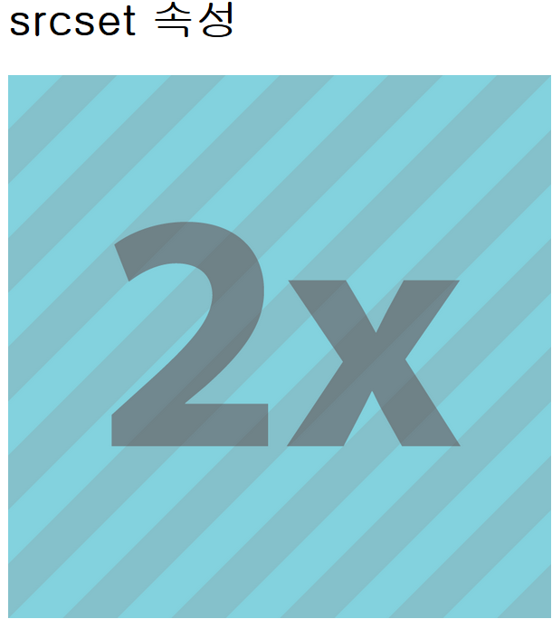

# srcset
1. 실행 결과<br><br>
 - window10, samsung노트북: nt900k3g
<br><br>
2. 코드
```html
<!--고해상도 대응-->
<h1>srcset 속성</h1>

```
3. img
    - `src` : 고해상도 이미지를 지원할 목적이면 src는 srcset이 지원되지 않는 브라우저에 대한 대응책으로 경로에 있는 이미지를 사용하게 된다.
    - `srcset` : 각 디바이스 배율에 맞춰 이미지를 보여주는 속성.
4. 몰랐던 것
    - 고해상도 대응에 대한 것을 배우기 전까지는 이미지를 박스에 감싸서 박스 크기만큼 늘리게 끔 해주면 되는 줄 알았는데
  img의 srcset을 쓰면 각 디바이스의 해상도 밀도에 따라 다르게 이미지를 보여줄 수 있다는 것을 알았다.
5. 관련자료
    - [device pixel density tester](https://bjango.com/articles/min-device-pixel-ratio/) 
    - [핸드폰 반응형 참고](http://troy.labs.daum.net/)
