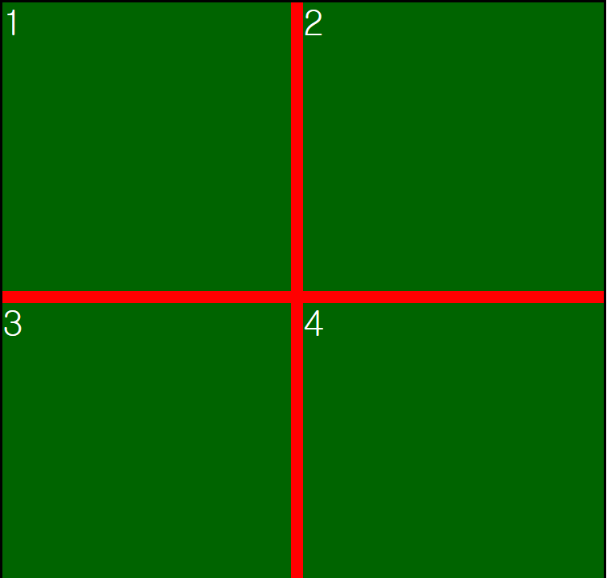

# 음수 마진 기법
- position: absolute 처럼 움직임.
- 음수 마진은 부모의 크기만큼 움직인다 (백분율을 사용했을 때)
- float를 이용하면 부모 넓이 안에서만 움직인다.
- margin-right: -100%를 했을 때 부모의 넓이만큼 자신의 영역이 줄어드는건가? <br>

```html
<div class="text-shadow">
    Welcome to my homepage
</div>
<div class="box-wrapper">
    <div class="text-box">
        Welcome to my homepage
    </div>
</div>
<div class="wrapper">
    <div class="box1">1</div>
    <div class="box2">2</div>
    <div class="box3">3</div>
    <div class="box4">4</div>
</div>
```
```css
@charset "utf-8";

body{
    margin: 50px;
}
.text-shadow{
    background: yellow;
    font-size: 60px;
}
.box-wrapper{
    width: 200px;
}
.text-box{
    /*background: pink;*/
    color: #f00;
    font-size: 10px;
    /*margin-top: -100%;*/
    margin-left: -1px;
}
.wrapper{
    margin-top: 100px;
    background: yellow;
    width: 500px;
    height: 500px;
    border: 2px solid #000;
    overflow: hidden;
}
.wrapper [class^="box"]{
    background: darkgreen;
    border: 10px solid red;
    width: 50%;
    height: 50%;
    float: left;
    color: #fff;
    font-size: 30px;
    /*margin-right: -100%;*/
    margin: -10px;
}
.box1{
    /*margin-left: 0;*/
}
.box2{
    /*margin-left: 100px;*/
}
.box3{
    /*margin-left: 200px;*/
}
.box4{
    /*margin-left: 300px;*/
}
```


# sass 문법 익히기
- 장점 : 간소화가 잘되어 있다( {}, ;, ... => x )
- 간소화로 인해 불편함이 생겨서 SCSS 문법이 생겨남.
- browser에서 source-map 보기
  - node-sass sass/ -o css/ --source-map true
  - chrome -> 개발자도구(settings) -> source -> Enabled CSS source map
- sass파일을 css로 변환
  - node-sass sass/ -o css/ --output-style "expanded | compact | compressed | nest(기본)"
- watch (실시간 감시기능)
  - node-sass -w / node-sass --watch
  - ctrl + c 종료하기
- 변수 사용하기 
  - flag 
    - default : 사용안함
    - global : 지역변수를 global변수로 사용하기 위해
```scss
$font-stack: Helvetica sans-serif;
$primary-color: #333;
$primary-color: #000 !default; 

body {
    $primary-color: yellow !global;
    font: 100% $font-stack;
    color: $primary-color;
}
```
- Nesting
```scss
.box {
    ul {
        margin: 0;
        padding: 0;
        list-style: none;
    }   
    li {
        display: inline-block;
    }
    a {
        display: block;
        padding: 6px 12px;
        background: $brand-color;
        text-decoration: none;
    }
}
```
- 보간법/내삽법
  - 변수를 내용 그대로 컴파일시키도록 만드는 방법
  - 사용법: #{변수}
  - 보간법 내 변수연산가능 => #{변수 + 변수}
```scss
font: #{$base-font-size} /#{$base-line-height} "Noto Sans KR";
```
- sass color function
  - sass 색상에 관련된 함수
  - [참고링크](https://robots.thoughtbot.com/controlling-color-with-sass-color-functions)
```scss
$brand-color: #ad141e;

background: darken( $brand-color, 10% );
background: lighten( $brand-color, 10% );
```
- partital
  - 모듈화 시키는 작업
  - 모듈화된 scss파일을 import해서 사용.
  - _"파일이름".scss _를 사용하면 css에 빌드되지 않음.
```scss
//_layout.scss
.col{
    float: left;
    width: 100%;
    min-height: 50px;
    margin-right: -100%;
}
.col-6 {
    width: 50%;
}
.col-offset-6{
    margin-left: 50%;
}

//_color.scss
$color-1: red;
$color-2: green;
$color-3: blue;
$color-4: yellow;

//_mixin.scss
@mixin border-radius($value){
    border-radius: ($value);
}


//_color.scss, _layout.scss, _mixin.scss import
//stylesheets.scss
@import "partials/color";
@import "partials/layout";
@import "partials/mixin";

body{
    color: $color-2;
    background-color: $color-4;
}
div{
    @include border-radius(50px);
}

```
```css
//css 변환 결과
.col {
  float: left;
  width: 100%;
  min-height: 50px;
  margin-right: -100%; }

.col-6 {
  width: 50%; }

.col-offset-6 {
  margin-left: 50%; }

body {
  color: green;
  background-color: yellow; }

div {
  border-radius: 50px; }

/*# sourceMappingURL=stylesheets.css.map */
```
- import
  - 다른 scss파일과 연결해서 사용하는 방법.
  - css파일로 변환하면 하나의 파일로 합쳐져서 보여짐.
```scss
// _reset.scss

html,
body,
ul,
ol {
   margin: 0;
  padding: 0;
}

// base.scss

@import 'reset';

body {
  font: 100% Helvetica, sans-serif;
  background-color: #efefef;
}

```
  - extend
    - @extend "클래스/ id";
```scss
.my-class{
    border: 1px solid #aaa;
    border-radius: 10px;
    padding: 10px;
    background: #eee;
}
.event{
    margin: 10px;
    @extend .my-class;
}
```
```css
/*css 빌드 결과*/
.my-class, .event {
  border: 1px solid #aaa;
  border-radius: 10px;
  padding: 10px;
  background: #eee; }

.event {
  margin: 10px; }
```

  - placeholder selector
    - 선택자로 선택되지 않고 가져다 쓰는 module형식으로 사용
```scss
%my-class{
    border: 1px solid #aaa;
    border-radius: 10px;
    padding: 10px;
    background: #eee;
}
.event{
    margin: 10px;
    @extend %my-class;
}
.favorite{
    box-shadow: 1px 1px 0 0 #000;
    @extend %my-class;
}
```
```css
/*css build 결과*/
.event, .favorite {
  border: 1px solid #aaa;
  border-radius: 10px;
  padding: 10px;
  background: #eee; }

.event {
  margin: 10px; }

.favorite {
  box-shadow: 1px 1px 0 0 #000; }

```
  - mixin
    - @mixin "함수이름"(){ }
    - & : 해당 태그나 클래스에 적용.
```scss
@mixin clearfix(){
    &::after{
        content: "";
        display: table;
        clear: both;       
    }
}

.favorite{
    box-shadow: 1px 1px 0 0 #000;
    @extend %my-class;
    @include clearfix();
}
```
```css
/*css build 결과*/
.favorite {
    box-shadow: 1px 1px 0 0 #000; 
}
.favorite::after {
    content: "";
    display: table;
    clear: both; 
}
```

- 단위 추가방법
  - $width * 1px
  - $width + px

```scss
$width: 100;
$height: 100px;
.search{
    // 단위 추가
    width: $width * 1px;
    // 단위 제거
    height: $height / 1px;
}
```
```css
/*css build 결과*/
.search {
  width: 100px;
  height: 100; 
}
```

  - for문 
    - @for $i from n (to, through) (m-1){ }
```scss
@for $i from 1 to 5{
    .col-#{$i}{
        width: 100px;
    }
}
```
```css
/*css build 결과*/
.col-1 {
  width: 100px; }

.col-2 {
  width: 100px; }

.col-3 {
  width: 100px; }

.col-4 {
  width: 100px; }
```